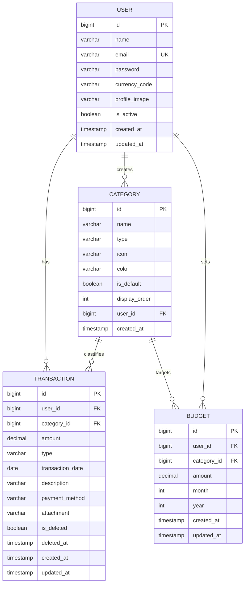

# ExpensePro — Design Document

> **Version:** 1.0.0 · **Date:** April 2026 · **Author:** Engineering Team

---

## Table of Contents

1. [Project Overview](#1-project-overview)
2. [System Architecture](#2-system-architecture)
3. [Technology Stack](#3-technology-stack)
4. [Data Model](#4-data-model)
5. [Backend Design](#5-backend-design)
6. [REST API Reference](#6-rest-api-reference)
7. [Frontend Design](#7-frontend-design)
8. [Security Architecture](#8-security-architecture)
9. [State Management](#9-state-management)
10. [Deployment](#10-deployment)

---

## 1. Project Overview

**ExpensePro** is a full-stack personal finance management web application that enables users to track income and expenses, analyse spending patterns by category, and manage monthly budgets.

### Core Features

| Feature | Description |
|---|---|
| Authentication | JWT-based register/login with BCrypt password hashing |
| Transactions | Create, read, update, soft-delete income/expense records |
| Categories | System-default & user-custom categories with icons & colours |
| Dashboard | Balance summary, recent transactions, 6-month spending trend |
| Analytics | Category-breakdown charts (pie / bar) of all-time expenses |
| Settings | Profile update, currency preference |

### Goals

- **Security first** — stateless JWT authentication; all user data is scoped per authenticated user.
- **Performance** — database-level indexes on hot query paths; Spring Data paging.
- **Developer experience** — Lombok, Spring Boot auto-config, Vite HMR.

---

## 2. System Architecture

```
┌────────────────────────────────────────────────────┐
│                    Browser (SPA)                   │
│  React 18 + Vite  ·  Redux Toolkit  ·  MUI v5     │
│  Pages: Login / Register / Dashboard /             │
│          Transactions / Analytics / Settings       │
└──────────────────────┬─────────────────────────────┘
                       │  HTTP/REST  (Bearer JWT)
                       │  Base URL: http://localhost:8080/api
┌──────────────────────▼─────────────────────────────┐
│           Spring Boot 3.2 REST API (Port 8080)     │
│                                                    │
│  ┌──────────────┐  ┌────────────┐  ┌────────────┐ │
│  │ AuthCtrl     │  │ TxnCtrl    │  │ CategoryCtrl│ │
│  └──────┬───────┘  └─────┬──────┘  └─────┬──────┘ │
│         │                │               │        │
│  ┌──────▼───────────────────────────────▼──────┐  │
│  │           Service Layer (Business Logic)    │  │
│  └──────────────────────┬──────────────────────┘  │
│                         │  Spring Data JPA         │
│  ┌──────────────────────▼──────────────────────┐  │
│  │     Repository Layer  (JpaRepository)       │  │
│  └──────────────────────┬──────────────────────┘  │
│                         │  JDBC / Hibernate        │
└─────────────────────────┼────────────────────────┘
                          │
              ┌───────────▼───────────┐
              │   PostgreSQL Database  │
              │  Schema via Liquibase │
              └───────────────────────┘
```

### Communication Flow

1. User authenticates → receives a signed JWT.
2. All subsequent API calls include the JWT in the `Authorization: Bearer <token>` header.
3. `JwtAuthFilter` validates the token on every request, populates `SecurityContext`.
4. Controllers delegate to services, which read/write via JPA repositories.
5. The React SPA consumes API responses and renders via component state / Redux.

---

## 3. Technology Stack

### Backend

| Layer | Technology | Version |
|---|---|---|
| Runtime | Java | 17 |
| Framework | Spring Boot | 3.2.0 |
| Web | Spring MVC (REST) | — |
| Security | Spring Security | — |
| JWT | JJWT | 0.12.3 |
| ORM | Spring Data JPA / Hibernate | — |
| DB Migration | Liquibase | — |
| Database | PostgreSQL | — |
| Boilerplate | Lombok | 1.18.30 |
| Build | Apache Maven | — |

### Frontend

| Layer | Technology | Version |
|---|---|---|
| UI Framework | React | 18.2 |
| Build tool | Vite | 5.2 |
| Routing | React Router DOM | 6.20 |
| State | Redux Toolkit | 2.0 |
| HTTP Client | Axios | 1.6 |
| UI Components | MUI (Material UI) | 5.15 |
| Forms | Formik + Yup | 2.4 / 1.3 |
| Charts | Chart.js + react-chartjs-2 / Recharts | 4.4 / 2.10 |
| Date Utils | date-fns | 3.0 |
| Notifications | react-hot-toast | 2.4 |
| File Export | file-saver | 2.0 |

---

## 4. Data Model

### Entity Relationship Diagram



### Key Design Decisions

- **Soft delete on Transactions** — `is_deleted` flag + `deleted_at` timestamp; records are never physically removed, preserving audit history.
- **Global + User categories** — `category.user_id IS NULL` means a system-default category; user-created categories have the owner's `user_id`.
- **Budget uniqueness** — composite unique constraint on `(user_id, category_id, month, year)` prevents duplicate monthly budget entries.
- **DB indexes on transactions** — indexes on `(user_id, transaction_date)`, `category_id`, and `type` optimise the most common query patterns.

### Enumerations

| Enum | Values |
|---|---|
| `TransactionType` | `INCOME`, `EXPENSE` |
| `PaymentMethod` | `CASH`, `CARD`, `BANK_TRANSFER`, `UPI`, … |
| `FrequencyType` | `DAILY`, `WEEKLY`, `MONTHLY`, `YEARLY` |
| `BudgetStatus` | (defined for future budget alerts) |

---

## 5. Backend Design

### Package Structure

```
com.expensetracker
├── BackendApplication.java          ← Spring Boot entry point
├── controller/
│   ├── AuthController.java          ← /api/auth/**
│   ├── TransactionController.java   ← /api/transactions/**
│   ├── CategoryController.java      ← /api/categories/**
│   └── UserController.java          ← /api/users/**
├── service/
│   ├── AuthService.java
│   ├── TransactionService.java
│   ├── CategoryService.java
│   └── UserService.java
├── repository/
│   ├── TransactionRepository.java
│   ├── CategoryRepository.java
│   ├── UserRepository.java
│   └── BudgetRepository.java
├── entity/
│   ├── User.java
│   ├── Transaction.java
│   ├── Category.java
│   └── Budget.java
├── dto/
│   ├── AuthRequest.java / AuthResponse.java / RegisterRequest.java
│   ├── TransactionRequest.java / TransactionDto.java
│   ├── CategoryDto.java
│   ├── UpdateProfileRequest.java
│   └── ApiResponse.java             ← generic wrapper {success, message, data}
├── enums/
│   └── TransactionType / PaymentMethod / FrequencyType / BudgetStatus
└── security/
    ├── SecurityConfig.java          ← CORS, filter chain, session policy
    ├── JwtService.java              ← token generation & validation
    ├── JwtAuthFilter.java           ← OncePerRequestFilter
    └── UserDetailsServiceImpl.java
```

### Service Layer Responsibilities

#### `TransactionService`
- **`getTransactions(userId, pageable)`** — returns paginated, non-deleted transactions sorted by `transactionDate DESC`.
- **`createTransaction(userId, request)`** — validates category ownership, builds & persists `Transaction`.
- **`updateTransaction(userId, id, request)`** — ownership check before update.
- **`deleteTransaction(userId, id)`** — soft-delete via `softDelete()`.
- **`getDashboardSummary(userId)`** — aggregates total income, total expenses, balance, last-6-months monthly trend, and 5 most-recent transactions.
- **`getCategoryAnalytics(userId)`** — JPQL group-by query returning `[categoryName, totalAmount, color, icon]`.

#### `AuthService`
- Registers users; validates uniqueness of email.
- Authenticates with `AuthenticationManager` + `DaoAuthenticationProvider`.
- Issues a JWT on successful login.

---

## 6. REST API Reference

> **Base URL:** `http://localhost:8080/api`
> All protected endpoints require header: `Authorization: Bearer <jwt>`

### Authentication — `/api/auth`

| Method | Path | Auth | Description |
|---|---|---|---|
| `POST` | `/auth/register` | ❌ Public | Register a new user |
| `POST` | `/auth/login` | ❌ Public | Authenticate and obtain JWT |

**`POST /auth/register`** request body:
```json
{
  "name": "Jane Doe",
  "email": "jane@example.com",
  "password": "Secret123!"
}
```

**`POST /auth/login`** response:
```json
{
  "success": true,
  "token": "<jwt>",
  "email": "jane@example.com",
  "name": "Jane Doe"
}
```

---

### Transactions — `/api/transactions`

| Method | Path | Auth | Description |
|---|---|---|---|
| `GET` | `/transactions` | ✅ | Paginated transaction list |
| `POST` | `/transactions` | ✅ | Create transaction |
| `PUT` | `/transactions/{id}` | ✅ | Update transaction |
| `DELETE` | `/transactions/{id}` | ✅ | Soft-delete transaction |
| `GET` | `/transactions/summary` | ✅ | Dashboard summary |
| `GET` | `/transactions/analytics` | ✅ | Category spending breakdown |

**Query params for `GET /transactions`:**
- `page` (default 0), `size` (default 20), `sort` e.g. `transactionDate,desc`

**`POST /transactions`** request body:
```json
{
  "categoryId": 3,
  "amount": 45.50,
  "type": "EXPENSE",
  "transactionDate": "2026-04-05",
  "description": "Lunch",
  "paymentMethod": "CARD"
}
```

**`GET /transactions/summary`** response shape:
```json
{
  "data": {
    "balance": 1520.00,
    "totalIncome": 3000.00,
    "totalExpenses": 1480.00,
    "monthlyTrend": [ [11, 320.0], [12, 450.0], [1, 380.0] ],
    "recentTransactions": [ /* last 5 TransactionDto */ ]
  }
}
```

---

### Categories — `/api/categories`

| Method | Path | Auth | Description |
|---|---|---|---|
| `GET` | `/categories` | ✅ | All categories (system + user's) |
| `POST` | `/categories` | ✅ | Create custom category |

---

### Users — `/api/users`

| Method | Path | Auth | Description |
|---|---|---|---|
| `GET` | `/users/profile` | ✅ | Current user's profile |
| `PUT` | `/users/profile` | ✅ | Update name / currency |

---

### Generic Response Wrapper — `ApiResponse<T>`

```json
{
  "success": true,
  "message": "Transaction created successfully",
  "data": { /* T */ }
}
```

---

## 7. Frontend Design

### Application Routes

```
/login          → Login.jsx         (public)
/register       → Register.jsx      (public)
/               → Dashboard.jsx     (protected, inside MainLayout)
/transactions   → Transactions.jsx  (protected)
/analytics      → Analytics.jsx     (protected)
/settings       → Settings.jsx      (protected)
```

Protected routes redirect to `/login` when the Redux `auth.isAuthenticated` flag is `false`.

### Component Tree

```
<App>
  ├── <BrowserRouter>
  │   ├── /login        → <Login />
  │   ├── /register     → <Register />
  │   └── /             → <MainLayout>   (auth guard)
  │        ├── Sidebar / Navigation
  │        ├── /             → <Dashboard />
  │        ├── /transactions → <Transactions />
  │        │                    └── <TransactionModal />
  │        ├── /analytics    → <Analytics />
  │        └── /settings     → <Settings />
```

### Pages

| Page | Key UI Elements |
|---|---|
| **Login** | Email/password form (Formik/Yup), link to Register |
| **Register** | Name/email/password form with validation |
| **Dashboard** | Balance card, income/expense summary cards, 6-month bar chart (Recharts), recent transactions list |
| **Transactions** | Paginated table, filter/sort controls, Add/Edit modal (`TransactionModal`), delete confirmation |
| **Analytics** | Pie chart by category, category-level spend table |
| **Settings** | Profile form (name, currency), password change |

### `TransactionModal`
A MUI Dialog overlay used for both _Create_ and _Edit_ workflows:
- Category picker (filtered by transaction type)
- Amount, date, description, payment method fields
- Formik-managed form state, Yup schema validation
- Calls `POST /transactions` or `PUT /transactions/{id}` on submit

### Styling
- Global CSS variables defined in `index.css` + `App.css`
- MUI `@emotion/styled` for component-level overrides
- Responsive layout built with MUI Grid and Box primitives

---

## 8. Security Architecture

```
Request
  │
  ▼
JwtAuthFilter (OncePerRequestFilter)
  │  Extract "Authorization: Bearer <token>"
  │  JwtService.validateToken()
  │  Load UserDetails → set SecurityContext
  ▼
SecurityFilterChain
  │  /api/auth/** → permitAll()
  │  all others   → authenticated()
  ▼
Controller → Principal (email from JWT subject)
  │  userRepository.findByEmail(principal.getName())
  ▼
Service (all DB operations scoped to authenticated userId)
```

### JWT Details

| Property | Value |
|---|---|
| Algorithm | HMAC-SHA (via JJWT `SecretKey`) |
| Expiration | Configurable (default 24 h) |
| Storage (client) | `localStorage` under key `token` |
| Transmission | `Authorization: Bearer <token>` header |

### Password Security
- Passwords hashed with **BCrypt** (`BCryptPasswordEncoder`).
- Raw passwords never persisted.

### CORS Policy
Allowed origins: `http://localhost:5173` (Vite), `http://localhost:3000` (CRA)
Allowed methods: `GET`, `POST`, `PUT`, `DELETE`, `OPTIONS`
Credentials: `true`

> [!WARNING]
> For production deployment, restrict `allowedOrigins` to the actual production domain and use environment-variable-driven CORS config.

---

## 9. State Management

Redux Toolkit is used for global client state.

### Store structure

```
store
└── auth
    ├── isAuthenticated : boolean
    ├── token           : string | null
    ├── user            : { name, email } | null
    └── loading         : boolean
```

### `authSlice` actions

| Action | Effect |
|---|---|
| `loginSuccess(payload)` | Sets `isAuthenticated = true`, stores token + user |
| `logout()` | Clears auth state + removes token from `localStorage` |

### Server State
All other API data (transactions, categories, analytics) is managed as **local component state** using `useState` + `useEffect` hooks with the shared `axios` instance. A `refreshKey` integer is incremented to trigger data re-fetches across pages without a full reload.

---

## 10. Deployment

### Local Development

```bash
# Backend (requires Java 17, PostgreSQL running)
cd backend
mvn spring-boot:run

# Frontend
cd frontend
npm install
npm run dev        # → http://localhost:5173
```

### Environment Variables (Backend — `application.properties`)

| Property | Example |
|---|---|
| `spring.datasource.url` | `jdbc:postgresql://localhost:5432/expensedb` |
| `spring.datasource.username` | `postgres` |
| `spring.datasource.password` | `secret` |
| `jwt.secret` | 256-bit base64 key |
| `jwt.expiration` | `86400000` (ms) |

### Containerization (Docker)

The project is deployable as Docker containers. A typical compose setup:

```yaml
services:
  db:
    image: postgres:15
    environment:
      POSTGRES_DB: expensedb
      POSTGRES_USER: postgres
      POSTGRES_PASSWORD: secret

  backend:
    build: ./backend
    ports: ["8080:8080"]
    depends_on: [db]

  frontend:
    build: ./frontend
    ports: ["80:80"]
```

> [!NOTE]
> For a production Nginx-served frontend, update the Axios `baseURL` to the backend's public URL before building (`npm run build`).

---

## Appendix — Key Conventions

- **BigDecimal for currency** — all monetary values use `BigDecimal(15,2)` to avoid floating-point rounding errors.
- **Soft delete pattern** — `is_deleted + deleted_at` on `transactions`; all queries filter `isDeleted = false`.
- **DTO / Entity separation** — entities are internal; controllers and services exchange DTOs, keeping the domain model encapsulated.
- **Builder pattern** — Lombok `@Builder` on all entities and DTOs for readable construction.
- **Ownership checks in services** — every mutating operation verifies that the target record belongs to the authenticated `userId` before proceeding.
